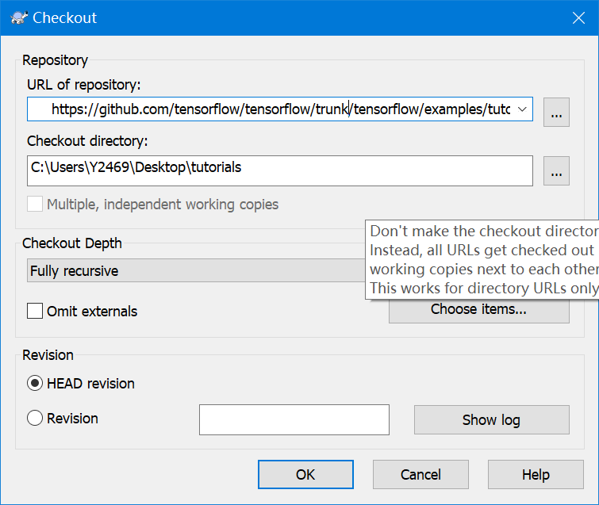

#### 1.遇到了pycharm中同级目录不能相互导入的问题 
```python
# 采用新的引入方法
from folder import modular
```
#### 2.在使用tensorflow时发现其所包含的文件并不满足需求，缺少了需要的tutorials文件夹，使用git方法去获取只能获取整个库，这里采用SVN来获取github上的tutorials文件夹 
```python
# 在github中获取到的链接
url = 'https://github.com/tensorflow/tensorflow/tree/master/tensorflow/examples/tutorials'
# 实际输入到SVN checkout中链接
url = 'https://github.com/tensorflow/tensorflow/trunk/tensorflow/examples/tutorials'
# 这里做了一个替换:将 "/branches/branchname/" 替换为 "/trunk/"
```
 
#### 3.使用tensorflow的placeholder模块时发现该模块已经被移除 
```python
# 原始代码
x = tf.placeholder(tf.float32,[None,784],name="X")
# 更改后的代码
x = tf.compat.v1.placeholder(tf.float32, [None, 784], name="X")
# 依旧报错
"RuntimeError: tf.placeholder() is not compatible with eager execution."
# 在前面加上代码
tf.compat.v1.disable_eager_execution()
```
#### 初始化偏置b的原因
```
'''
* 对于分类器而言，如果不加上偏置项b，那么我们的分类器只能过原点
* 通过偏置项，可以让模型在训练的过程中，动态地调整分类器以画出最佳的决策面
'''
```

### 参考文献
```python
# 参考代码
url = 'https://www.cnblogs.com/HuangYJ/p/11642475.html'
# 数据集
url = 'http://yann.lecun.com/exdb/mnist/'
# tensorflow官方文档
url = 'https://www.tensorflow.org/'
``` 